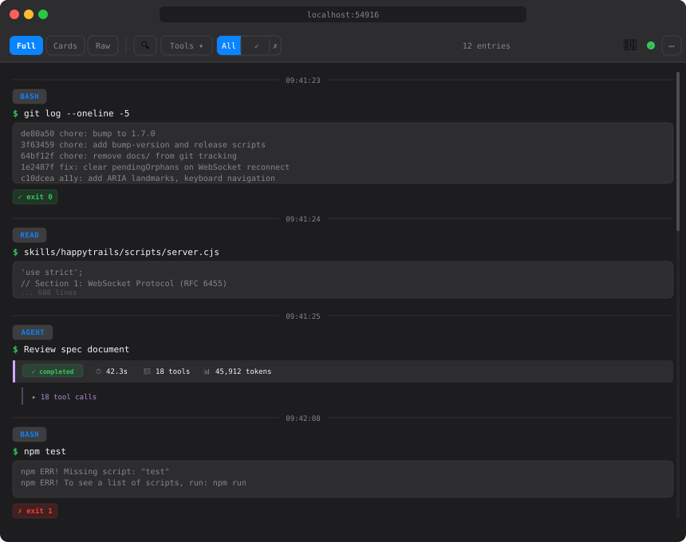
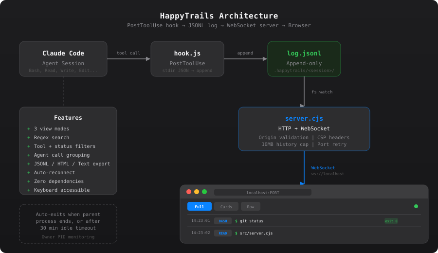

# HappyTrails

> **Experimental** — This project is functional and actively used, but the API and feature set may change between versions.

Live browser-based viewer for all Claude Code agent tool activity. Streams every tool call to an infinite-scroll HTML pane with three switchable view modes.



## Architecture



## Installation

HappyTrails is a Claude Code plugin installed via marketplace.

### 1. Add the marketplace

In Claude Code, run:

```
/install-plugin https://github.com/RCellar/HappyTrails.git
```

### 2. Restart Claude Code

The plugin registers a `PostToolUse` hook that captures every tool call. One restart is needed after initial installation.

### 3. Start a session

```
/happytrails
```

This starts the server on a random high port and provides a URL. Open it in your browser.

### Requirements

- Node.js (no npm install needed — zero external dependencies)
- Claude Code with plugin/hooks support

## Usage

### Start

Invoke `/happytrails` in Claude Code. The skill will:

1. Start the server on a random high port
2. Return a URL to open in your browser
3. Begin streaming all tool activity in real time

All subsequent tool calls are captured automatically. The hook discovers the active session via a `.happytrails/.active` pointer, so no configuration is needed between sessions.

### Stop

Invoke `/happytrails-stop` to shut down the server. The server also auto-exits when the parent Claude Code process ends, or after 30 minutes of inactivity.

### Transcript Mode

For environments where PostToolUse hooks are not available:

```
/happytrails transcript
```

This watches Claude Code's transcript file directly instead of relying on hooks. Agent grouping and inline stats are not available in this mode.

## View Modes

Switch between three display modes with a single click — all render from the same data:

- **Full Verbose** — Timestamped entries with command, full output, and color-coded exit badges
- **Structured Cards** — Collapsible cards with success/failure indicators, click to expand output
- **Raw Terminal** — Dark monospace stream mimicking `tail -f`, sequential output with no chrome

## Features

- **Regex search** with highlighted matches across all view modes
- **Tool type filter** — show/hide specific tools (Bash, Read, Write, Edit, Grep, etc.)
- **Status filter** — filter by success or failure
- **Agent call grouping** — subagent tool calls nest under their parent Agent entry with inline stats (duration, tool count, tokens)
- **Export** — JSONL, HTML, or plain text, with optional filter/search application
- **Entry count** with filter summary and truncation notice
- **Auto-scroll** — follows new entries; scroll up to pause, scroll back to resume
- **Auto-reconnect** — reconnects automatically if the WebSocket connection drops
- **Dark/light mode** — respects system `prefers-color-scheme`
- **Keyboard accessible** — Tab/Enter/Space navigation for cards and toggles
- **Zero dependencies** — no npm packages, WebSocket protocol implemented from scratch (RFC 6455)

## What Gets Captured

Every tool the agent uses:

| Tool | What's Shown |
|------|-------------|
| Bash | Command, stdout/stderr, exit code |
| Read | File path, content |
| Write | File path, result |
| Edit | File path, old/new strings, result |
| Grep | Pattern, path, matches |
| Glob | Pattern, matched files |
| Agent | Description, response, duration, tool count, tokens |
| Others | Tool name, raw input/output |

## Configuration

The server accepts these options via `start-server.sh`:

| Flag | Description | Default |
|------|-------------|---------|
| `--project-dir <path>` | Store session files under `<path>/.happytrails/` | `/tmp` |
| `--host <host>` | Bind address | `127.0.0.1` |
| `--url-host <host>` | Hostname in returned URL | `localhost` |
| `--owner-pid <pid>` | Parent PID for auto-shutdown | auto-detected |
| `--transcript-path <path>` | Watch transcript file instead of hook log | — |
| `--foreground` | Run in foreground (no backgrounding) | auto-detect |

## Security

- WebSocket origin validation prevents cross-origin data exfiltration
- Content Security Policy headers restrict resource loading
- Server binds to `127.0.0.1` by default (localhost only)
- No data leaves the local machine — all communication is over localhost

## Project Structure

```
HappyTrails/
├── .claude-plugin/
│   ├── plugin.json         # Plugin metadata
│   └── marketplace.json    # Marketplace listing
├── hooks/
│   └── hooks.json          # PostToolUse hook declaration
├── skills/
│   ├── happytrails/
│   │   ├── SKILL.md        # Start session skill
│   │   └── scripts/
│   │       ├── server.cjs      # HTTP/WebSocket server
│   │       ├── hook.js         # PostToolUse hook handler
│   │       ├── client.html     # Browser client (all view modes)
│   │       ├── start-server.sh # Server launcher
│   │       └── stop-server.sh  # Server shutdown
│   └── happytrails-stop/
│       └── SKILL.md        # Stop session skill
└── assets/
    └── architecture.svg    # Architecture diagram
```

## License

MIT License. See [LICENSE](LICENSE).
